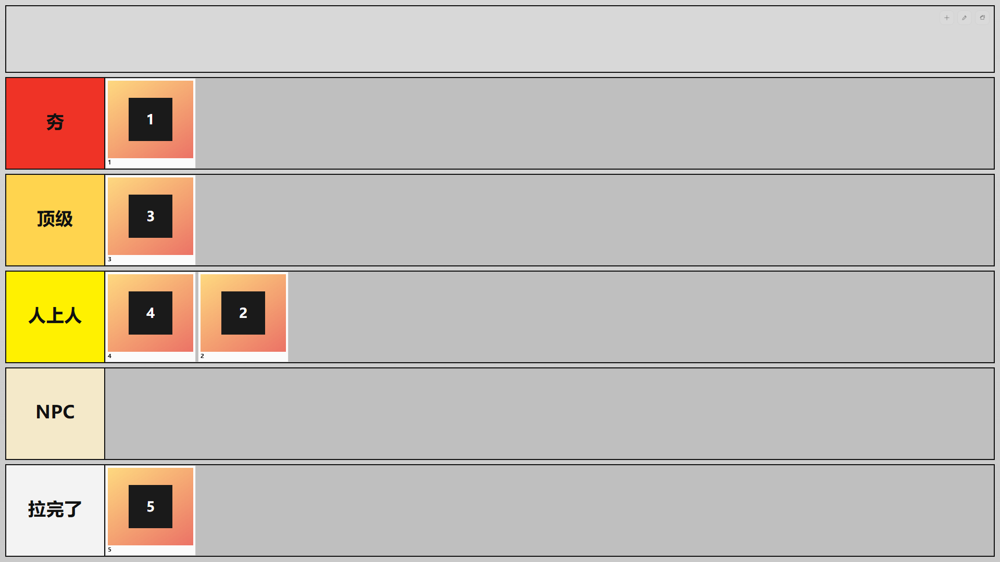

# hang-la

一个“夯到拉”桌面排序工具，用来把一组内容按中国互联网语境下的“夯、顶级、人上人、NPC、拉完了”进行可视化分档。

它适合拿来排品牌、游戏、影视、角色、产品、UP 主、餐饮、平台设计、数码设备，或者任何你想做一屏式主观排序的对象。

## 软件截图



## 核心功能

- 6 个横向栏位，一屏内完成展示与排序：
	- 自定义内容栏
	- 夯
	- 顶级
	- 人上人
	- NPC
	- 拉完了
- 支持拖拽卡片到任意栏位，并在栏位内调整顺序。
- 支持新增排序项，卡片可以使用文字图标，也可以使用本地图片作为封面。
- 支持编辑模式：
	- 点击右上角编辑按钮进入编辑模式。
	- 编辑模式下点击卡片即可修改内容。
	- 编辑模式下卡片右上角会显示编辑和删除图标。
	- 删除操作带二次确认，避免误删。
- 支持全屏模式，方便在投屏、直播、讨论或评比场景下使用。
- 自动保存在本地，关闭窗口后再次打开仍会保留上次排序结果。

## 适用场景

- 内容分级：给电影、剧集、动漫、游戏、歌曲、书籍做个人排名。
- 品牌比较：给咖啡、奶茶、手机、汽车、平台、服装品牌做印象排序。
- 角色评价：给游戏角色、动漫人物、主播、UP 主、明星做主观分档。
- 团队讨论：在小组讨论、选题会、评审会里快速把候选项拖进不同档位。
- 娱乐互动：在直播、朋友聊天、社群活动中做一张带观点的“夯到拉榜单”。

## 使用方式

1. 在最上方自定义内容栏右上角点击“新建”按钮，添加新的排序项。
2. 为排序项填写名称，可选填写文字图标、备注，或选择一张本地图片。
3. 将卡片从自定义内容栏拖到下方任意档位。
4. 如果需要修改内容，点击右上角“编辑模式”按钮进入编辑模式，再点击卡片进行编辑。
5. 如果需要更大的展示空间，点击右上角“全屏”按钮进入全屏，再次点击可恢复窗口。

## 启动

```bash
npm install
npm start
```

项目内已配置 Electron 二进制镜像，国内网络环境下安装会更稳定。

## 项目结构

```text
src/
	main.js
	preload.js
	renderer/
		app.js
		index.html
		styles.css
```